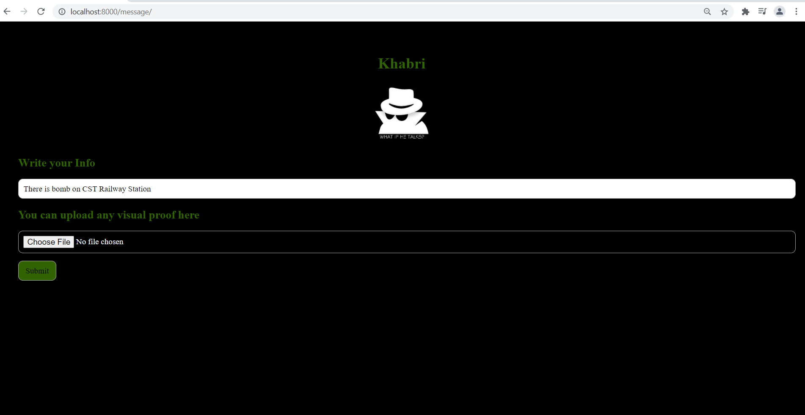

# You Need to execute following commands initially.

```
pip3 install django
pip3 install -r reqiurements.txt
python manage.py migrate
python manage.py runserver
```
#### Now you are good to go,




